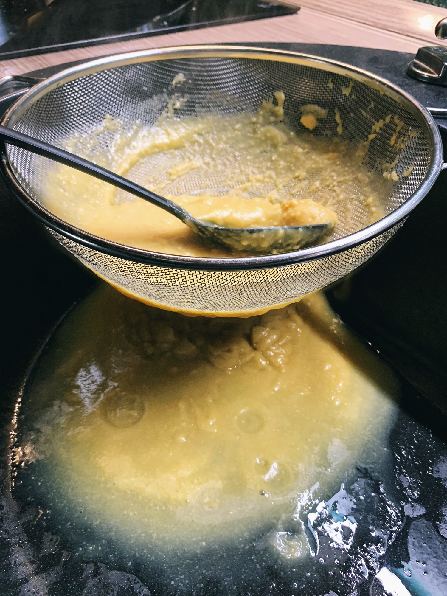
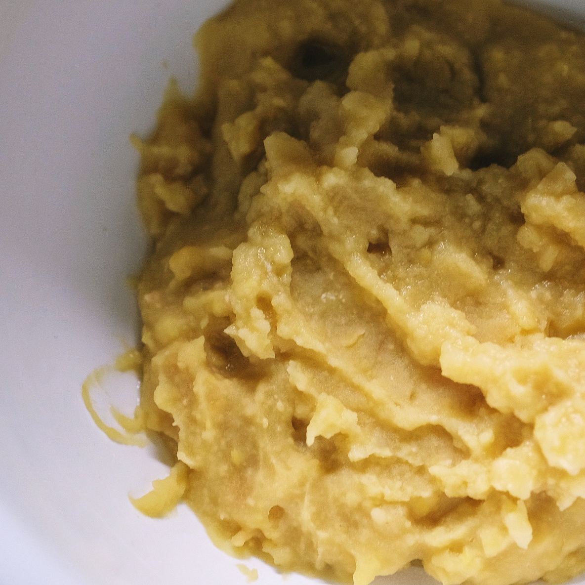
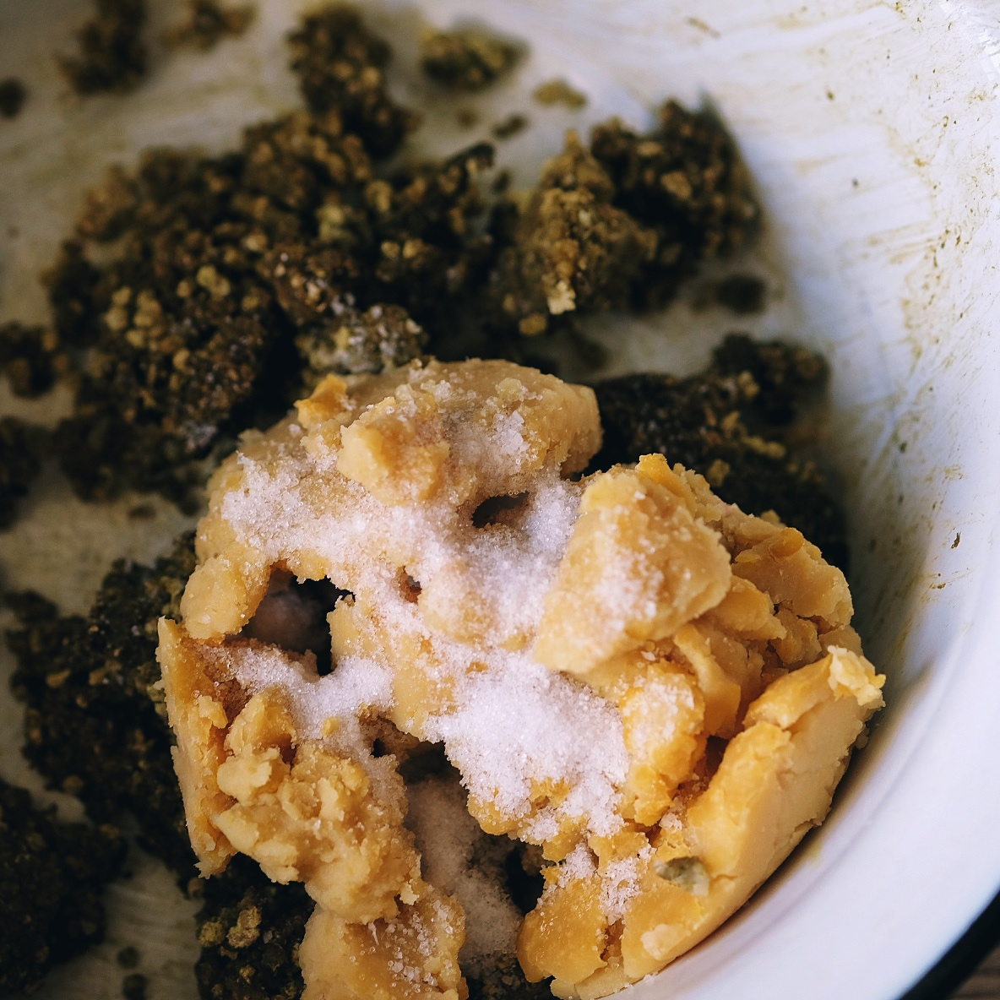
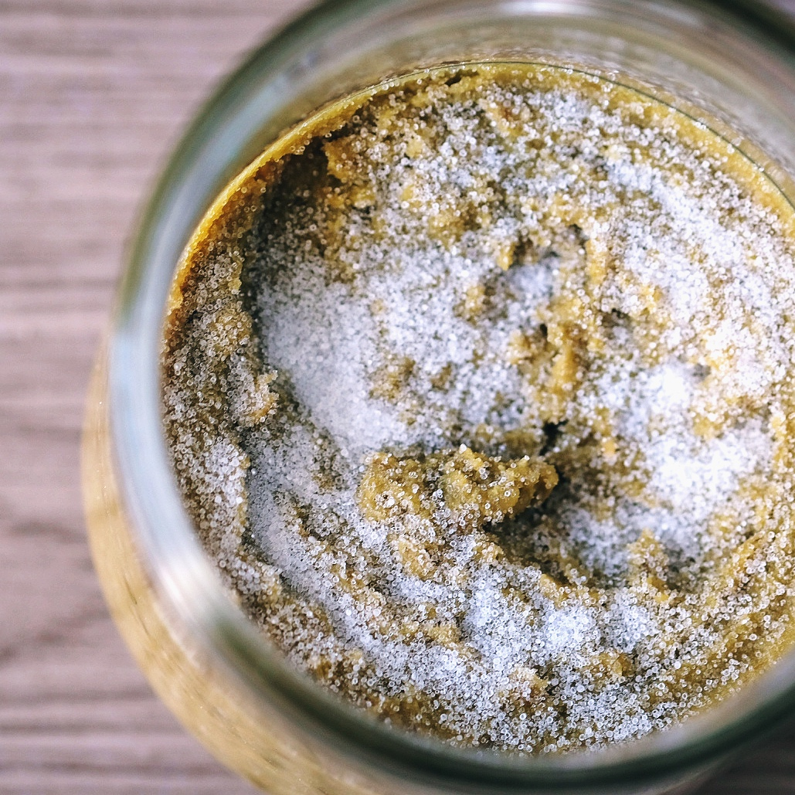

# \#1

Kommt es zu der Situation, dass man zwei verschieden Misos und ein Shoyu versucht an einem Abend anzusetzen, mal eben schnell zwischendurch, hat man dann unter Umständen keine Lust mehr, die Feuchtigkeit vom einen Miso zu regulieren. Das Miso war also zu feucht. Man konnte den vermengten Erbsenbrei, mit etwas Kraftaufwand zwischen den Finger hindurch drücken. Ein Zeichen, dass es zu feucht ist. Weiter, war es, vllt. dadurch, zu klebrig und es war mir schlichtweg nicht möglich, dass ohne Lufteinschlüsse ins Glas zu bekommen, da sich die Masse im Glas immer wieder verschoben hat und am hölzernen Kartoffelstampfer kleben blieb. So ist es nun im Glas – mit Luft. Leider.

| Zutat | Menge |
| :--- | :--- |
| Gelbe Erbsen, gekocht | 270g |
| Koji, Perlgraupen | 180g |
| Salz | 19g |

