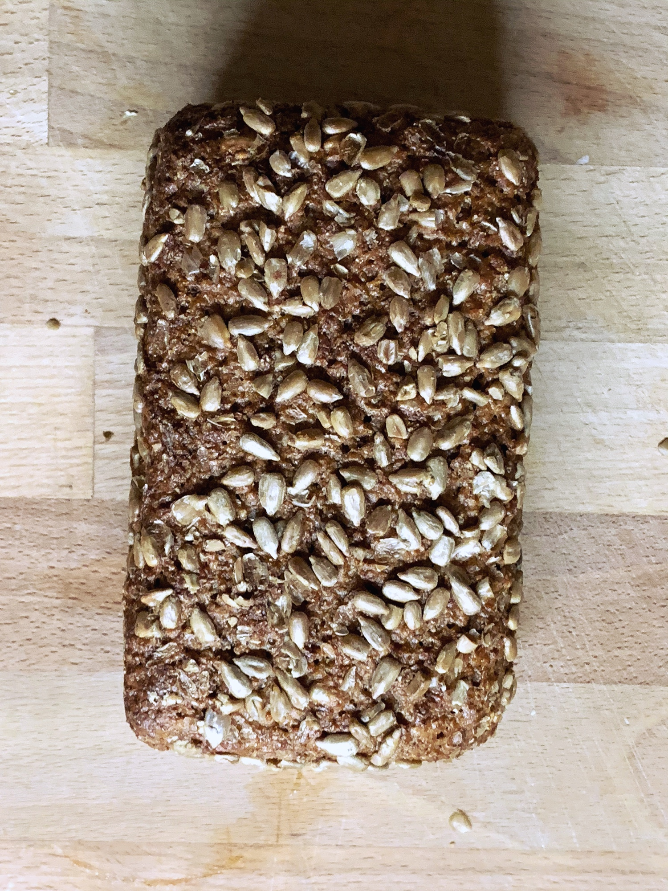
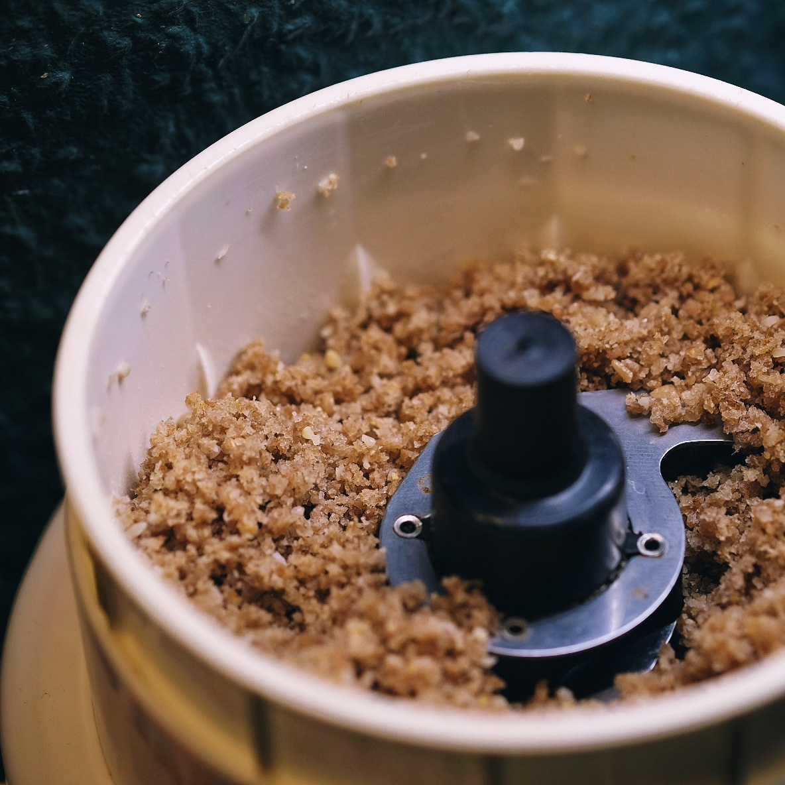
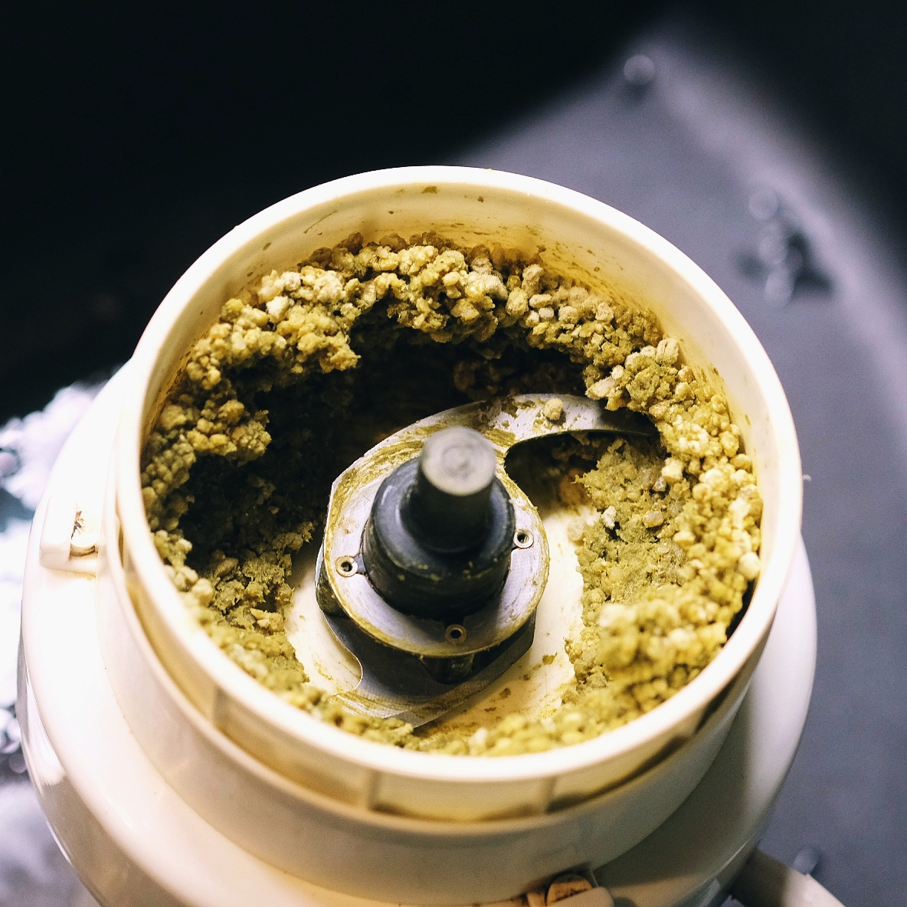
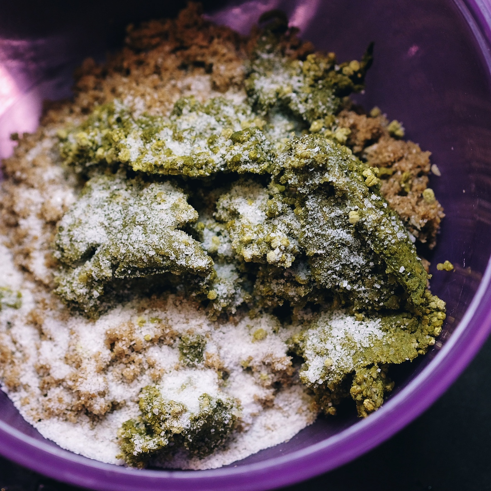
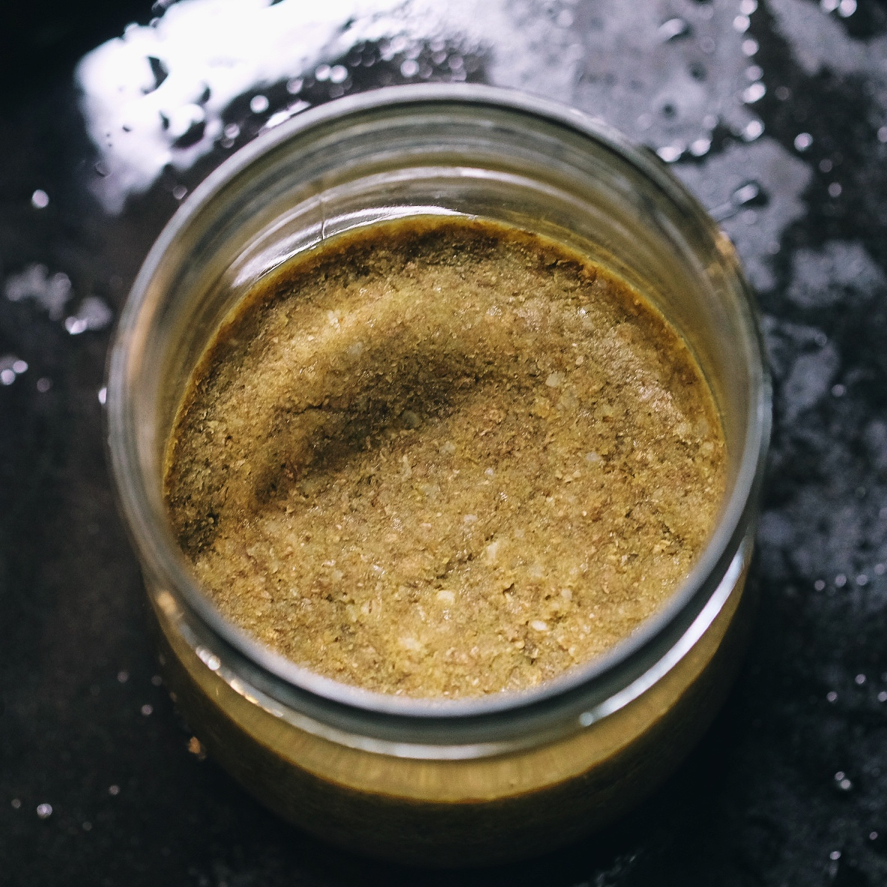
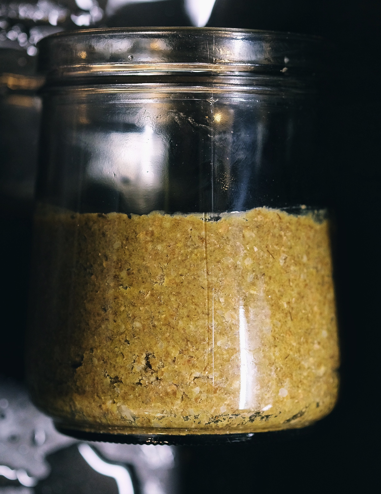
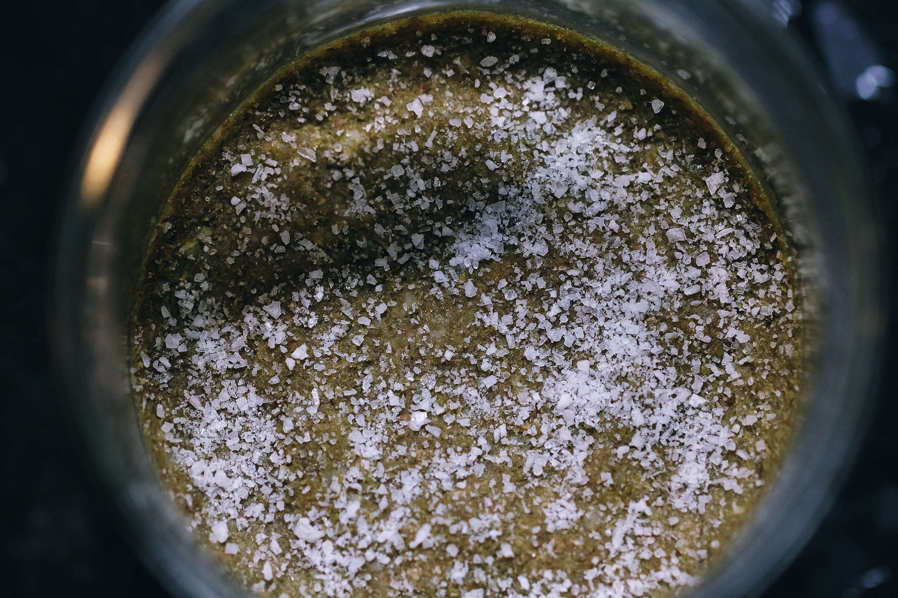

# \#1

Frisches Vollkorn-Roggenbrot hat die ideale Feuchtigkeit, zusammen mit frischem Koji, so dass man keinerlei Steuerung der Feuchtigkeit mehr übernehmen muss.

| Zutat | Menge |
| :--- | :--- |
| Roggenvollkornbrot, geschrotet | 255g |
| Koji, Perlgraupen | 170g |
| Salz | 19 |

