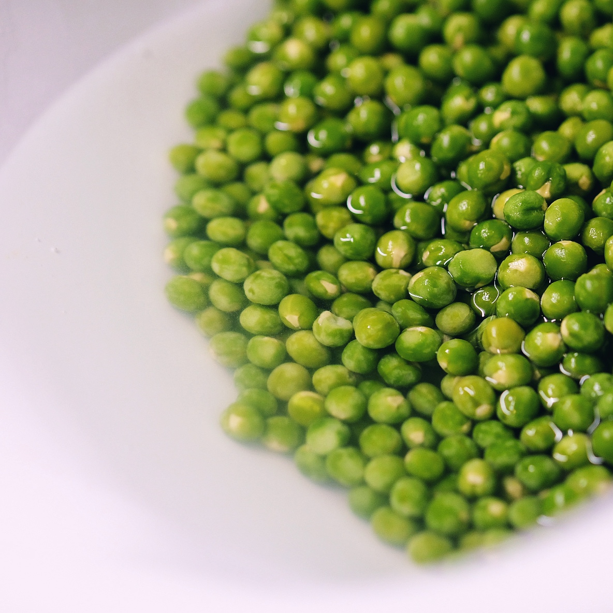
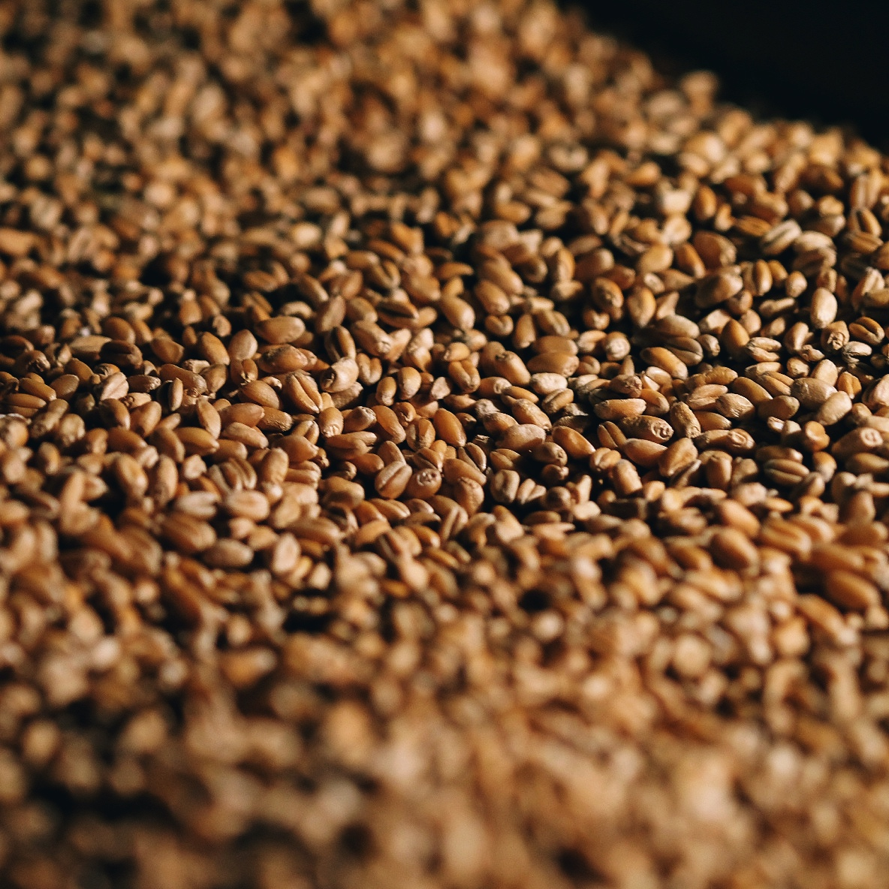
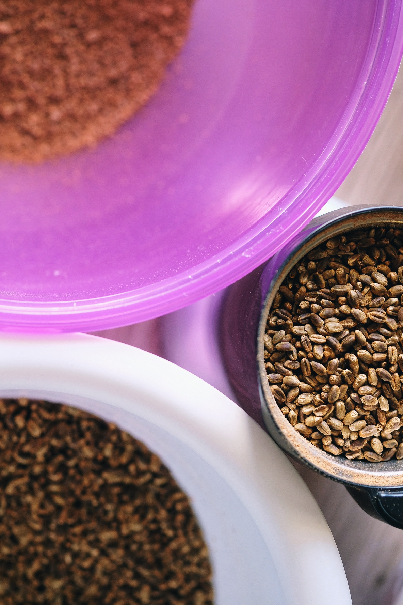
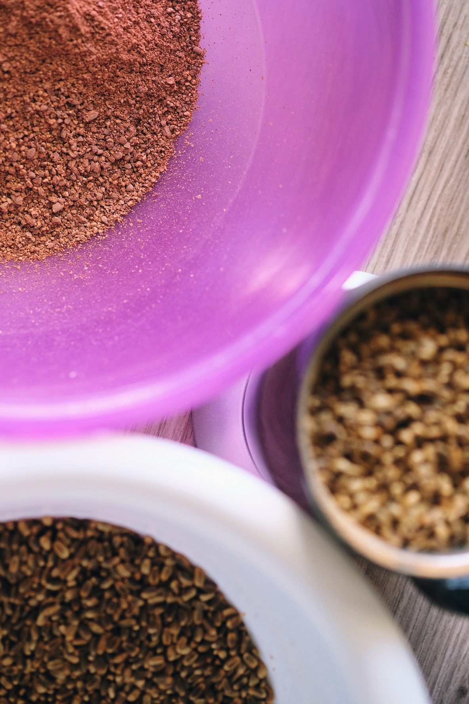
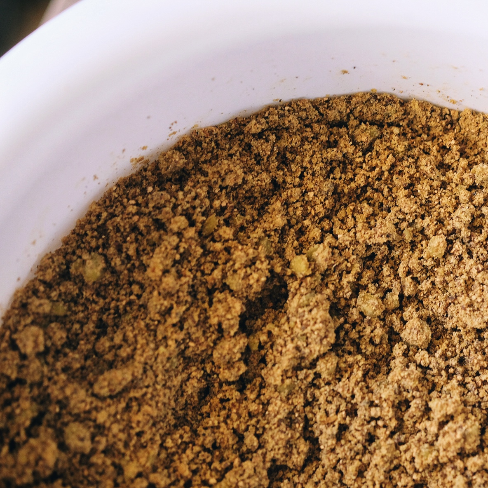
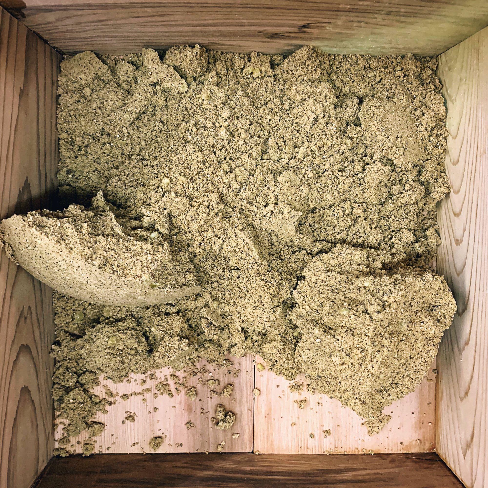
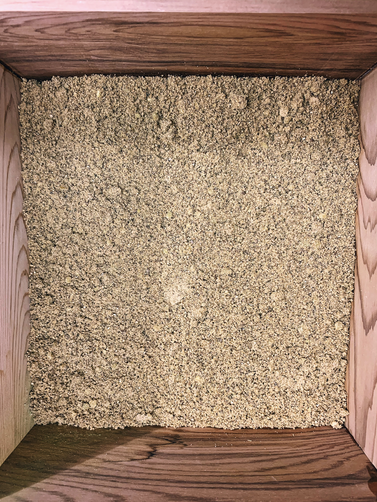

# \#1 – Grüne Erbsen Shoyu

| Zutat | Menge |
| :--- | :--- |
| Grüne Erbsen, gekocht | 900g |
| Weizen, dunkel geröstet, geschrotet | 485g |
| Aspergillus Oryzae | 1/2 TL |

## 1. Fermentation

| Temperatur | von | bis |
| :--- | :--- | :--- |
| 25ºC | 18.03.20 12:00 | 19.03.20 09:00 |
| 29ºC | 19.03.20 09:00 | 20.03.20 12:00 |

