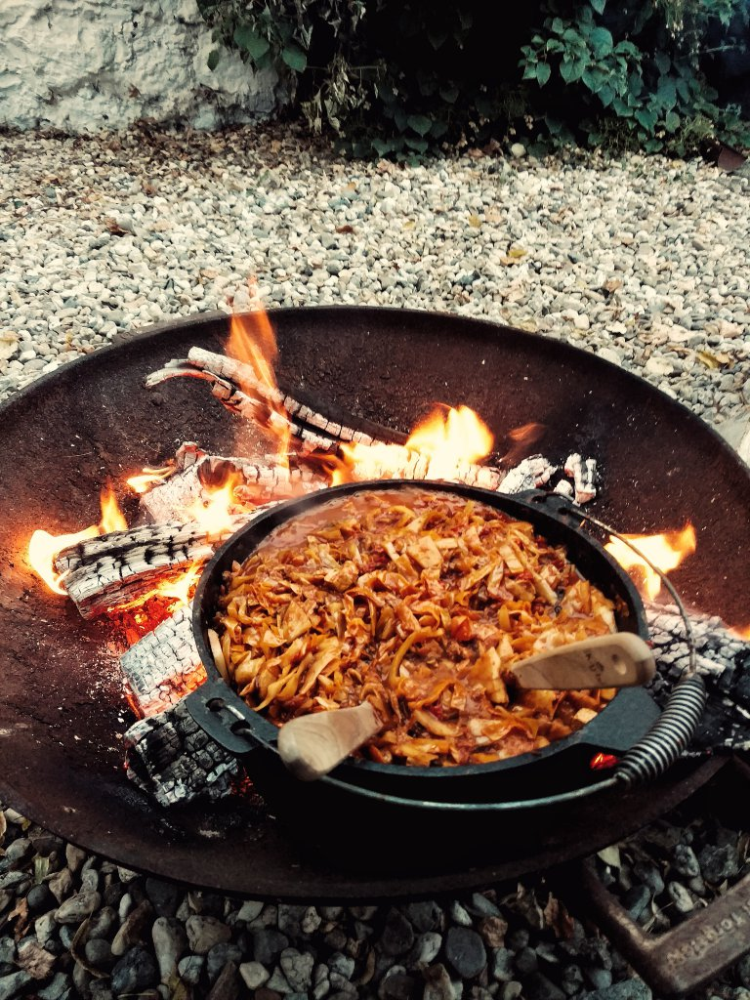

# Bigos

| Zutat | Menge | Schnitt |
| :--- | :--- | :--- |
| Weißkohl | 3 Pfund | fein gehobelt |
| Sauerkraut | 3 Pfund |  |
| Wurst \(pflanzl. Merguez\) | 3/2 Pfund | normal |
| Tomaten, geschält | 2 kl. Dosen |  |
| Äpfel | 2 | fein |
| Zwiebeln | 2 | grob |
| Tomaten | 2 | grob |
| Tomatenmark | 1 Tube |  |
| Pflaumen, trocken | 1 Pkg. | möglichst fein |
| Trockenbrühe | 1 EL |  |
| Lorbeer | 3 Blatt |  |
| opt.: Piment, Paprika |  |  |

