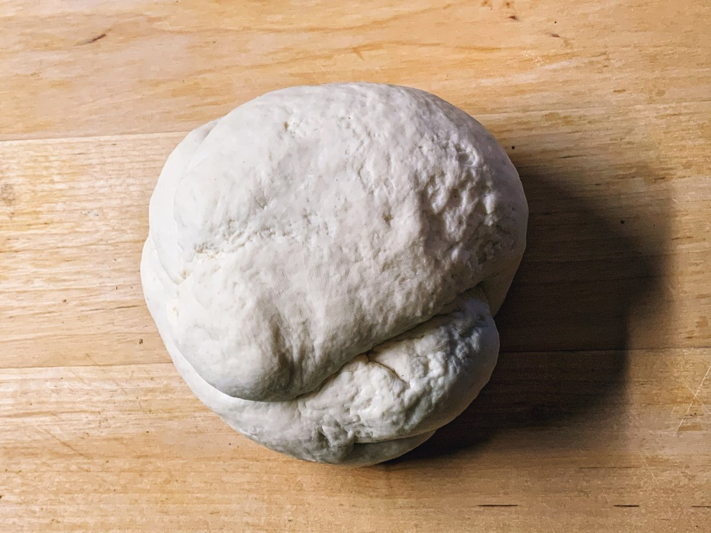
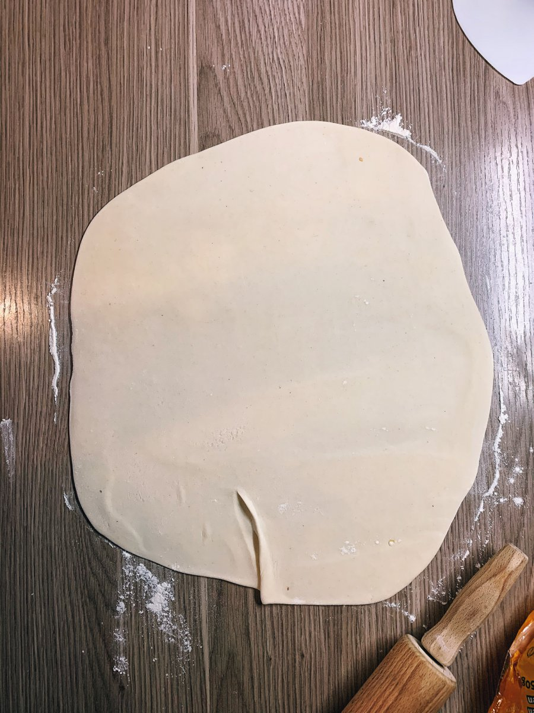
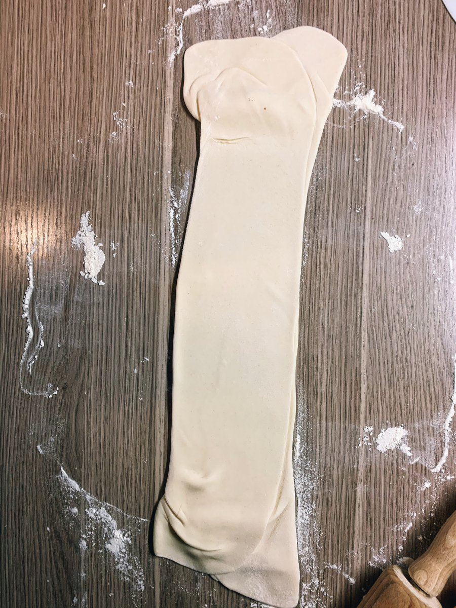
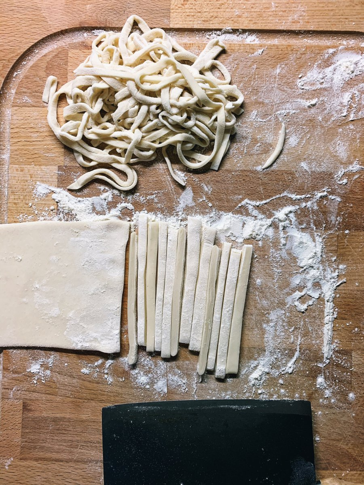
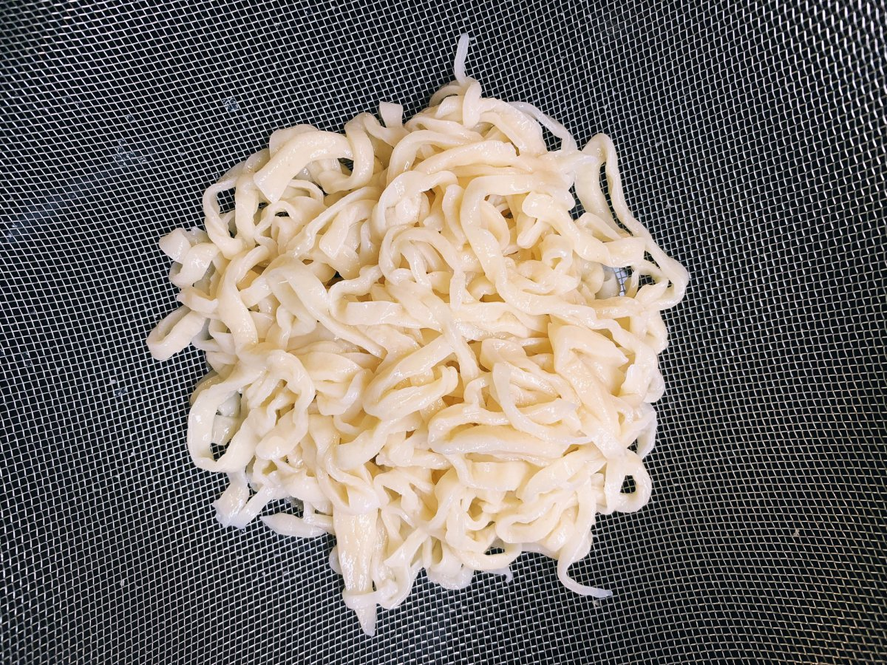

# Udon

* 700g haushaltstyp. 550er Mehl \(~ 10% Glutenanteil\)
* 360ml Wasser
* 1 EL Salz

Mehl mit Salz vermengen, Wasser hinzu geben — Kneten, kneten, kneten. Den Teig, natürlich abgedeckt, einen halben Tag entspannen lassen.

Nach dem Entspannen, den Teig in vier Teile teilen, mit Mehl besprenkeln und erneut entspannen lassen. Im Anschluss verarbeiten.


Ausgerollt, sollte der Teig etwa 5mm Dicke haben, bevor man die Nudeln schneidet.


> [https://steamykitchen.com/43189-homemade-udon-noodle-recipe-morimoto.html](https://steamykitchen.com/43189-homemade-udon-noodle-recipe-morimoto.html)

